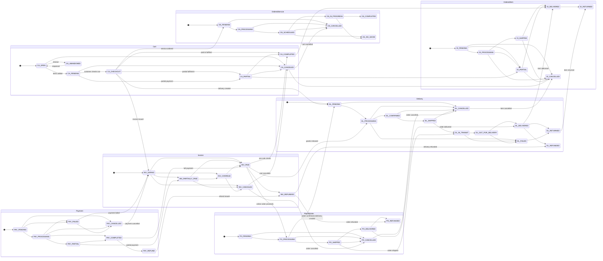

# Cart / Order / Service → Delivery → Payment → Invoice — State Schema

```mermaid
stateDiagram-v2
    direction LR

    %% ============================================================
    %% CART  (selling point / point-of-sale flow)
    %% alternative origin to PlacedOrder — may carry items AND services
    %% ============================================================
    state "Cart" as CA {
        [*] --> CA_OPEN
        CA_OPEN --> CA_PENDING : items added
        CA_OPEN --> CA_ABANDONED : timeout
        CA_PENDING --> CA_CHECKOUT : customer checks out
        CA_CHECKOUT --> CA_COMPLETED : paid & fulfilled
        CA_CHECKOUT --> CA_PARTIAL : partial fulfilment
        CA_PARTIAL --> CA_COMPLETED
        CA_PENDING --> CA_PARTIAL : partial payment
        CA_OPEN --> CA_CANCELED
        CA_PENDING --> CA_CANCELED
        CA_PARTIAL --> CA_CANCELED
        CA_ABANDONED --> CA_OPEN : reopened
    }

    %% ============================================================
    %% PLACED ORDER  (online / app flow)
    %% alternative origin to Cart
    %% ============================================================
    state "PlacedOrder" as PO {
        [*] --> PO_PENDING
        PO_PENDING --> PO_PROCESSING
        PO_PROCESSING --> PO_SHIPPED
        PO_SHIPPED --> PO_DELIVERED
        PO_DELIVERED --> PO_REFUNDED

        PO_PENDING --> PO_CANCELLED
        PO_PROCESSING --> PO_CANCELLED
        PO_SHIPPED --> PO_CANCELLED
    }

    %% ============================================================
    %% ORDERED ITEM  (physical goods — shared by Cart and PlacedOrder)
    %% ============================================================
    state "OrderedItem" as OI {
        [*] --> OI_PENDING
        OI_PENDING --> OI_PROCESSING
        OI_PROCESSING --> OI_SHIPPED
        OI_SHIPPED --> OI_DELIVERED
        OI_DELIVERED --> OI_RETURNED

        OI_PENDING --> OI_CANCELLED
        OI_PROCESSING --> OI_CANCELLED
        OI_SHIPPED --> OI_CANCELLED

        OI_PENDING --> OI_PARTIAL
        OI_PROCESSING --> OI_PARTIAL
        OI_PARTIAL --> OI_DELIVERED
        OI_PARTIAL --> OI_CANCELLED
    }

    %% ============================================================
    %% ORDERED SERVICE  (immaterial service — cart-only)
    %% consumable requirements decrement product quantity
    %% ============================================================
    state "OrderedService" as OS {
        [*] --> OS_PENDING
        OS_PENDING --> OS_PROCESSING
        OS_PROCESSING --> OS_SCHEDULED
        OS_SCHEDULED --> OS_IN_PROGRESS
        OS_IN_PROGRESS --> OS_COMPLETED

        OS_PENDING --> OS_CANCELLED
        OS_PROCESSING --> OS_CANCELLED
        OS_SCHEDULED --> OS_CANCELLED

        OS_SCHEDULED --> OS_NO_SHOW
        OS_IN_PROGRESS --> OS_NO_SHOW
    }

    %% ============================================================
    %% DELIVERY
    %% ============================================================
    state "Delivery" as DL {
        [*] --> DL_PENDING
        DL_PENDING --> DL_PROCESSING
        DL_PROCESSING --> DL_CONFIRMED
        DL_CONFIRMED --> DL_SHIPPED
        DL_SHIPPED --> DL_IN_TRANSIT
        DL_IN_TRANSIT --> DL_OUT_FOR_DELIVERY
        DL_OUT_FOR_DELIVERY --> DL_DELIVERED
        DL_DELIVERED --> DL_RETURNED
        DL_DELIVERED --> DL_REFUNDED

        DL_PENDING --> DL_CANCELLED
        DL_PROCESSING --> DL_CANCELLED
        DL_CONFIRMED --> DL_CANCELLED
        DL_SHIPPED --> DL_CANCELLED

        DL_PROCESSING --> DL_FAILED
        DL_IN_TRANSIT --> DL_FAILED
        DL_OUT_FOR_DELIVERY --> DL_FAILED
        DL_FAILED --> DL_RETURNED
    }

    %% ============================================================
    %% INVOICE  (shared by Cart and PlacedOrder)
    %% ============================================================
    state "Invoice" as INV {
        [*] --> INV_UNPAID
        INV_UNPAID --> INV_PARTIALLY_PAID
        INV_UNPAID --> INV_PAID
        INV_UNPAID --> INV_OVERDUE
        INV_PARTIALLY_PAID --> INV_PAID
        INV_PARTIALLY_PAID --> INV_OVERDUE
        INV_OVERDUE --> INV_PAID
        INV_PAID --> INV_REFUNDED

        INV_UNPAID --> INV_CANCELED
        INV_PARTIALLY_PAID --> INV_CANCELED
        INV_OVERDUE --> INV_CANCELED
    }

    %% ============================================================
    %% PAYMENT  (shared by Cart and PlacedOrder)
    %% ============================================================
    state "Payment" as PAY {
        [*] --> PAY_PENDING
        PAY_PENDING --> PAY_PROCESSING
        PAY_PROCESSING --> PAY_COMPLETED
        PAY_PROCESSING --> PAY_PARTIAL
        PAY_PARTIAL --> PAY_COMPLETED
        PAY_PROCESSING --> PAY_FAILED
        PAY_PENDING --> PAY_FAILED

        PAY_PENDING --> PAY_CANCELLED
        PAY_PROCESSING --> PAY_CANCELLED
        PAY_FAILED --> PAY_CANCELLED

        PAY_COMPLETED --> PAY_REFUND
    }

    %% ============================================================
    %% ORIGIN COUPLING — Cart OR PlacedOrder feeds the same pipeline
    %% ============================================================
    CA_CHECKOUT --> INV_UNPAID : invoice issued
    CA_CHECKOUT --> DL_PENDING : delivery created
    CA_COMPLETED --> OI_DELIVERED
    CA_CANCELED --> OI_CANCELLED
    CA_PARTIAL --> OI_PARTIAL

    PO_PROCESSING --> DL_PENDING : order confirmed,\ndelivery created
    PO_SHIPPED --> DL_IN_TRANSIT : order shipped
    PO_DELIVERED --> DL_DELIVERED : order delivered
    PO_CANCELLED --> DL_CANCELLED : order cancelled

    %% ============================================================
    %% SERVICE COUPLING — services ordered from carts only,
    %% do NOT affect the order lifecycle; only consumable resource
    %% requirements decrement product quantity
    %% ============================================================
    CA_CHECKOUT --> OS_PENDING : service ordered
    CA_CANCELED --> OS_CANCELLED : cart cancelled
    

    %% ============================================================
    %% CROSS-ENTITY COUPLING — shared downstream
    %% ============================================================
    DL_DELIVERED --> OI_DELIVERED : item delivered
    DL_CANCELLED --> OI_CANCELLED : item cancelled
    DL_RETURNED --> OI_RETURNED : item returned

    INV_PAID --> PO_PROCESSING : online order proceeds
    INV_PAID --> CA_COMPLETED : pos sale closes
    INV_PAID --> DL_PROCESSING : goods released
    INV_REFUNDED --> PO_REFUNDED : order refunded
    INV_REFUNDED --> DL_REFUNDED : delivery refunded
    INV_CANCELED --> PO_CANCELLED : order cancelled
    INV_CANCELED --> CA_CANCELED : cart cancelled

    PAY_COMPLETED --> INV_PAID : full payment
    PAY_PARTIAL --> INV_PARTIALLY_PAID : partial payment
    PAY_FAILED --> INV_UNPAID : payment failed
    PAY_CANCELLED --> INV_UNPAID : payment cancelled
    PAY_REFUND --> INV_REFUNDED : refund issued
```